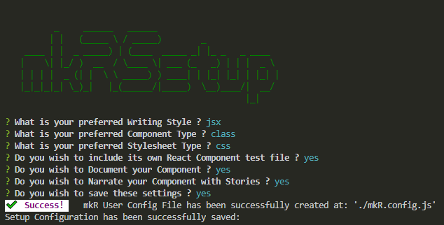
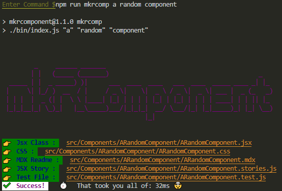
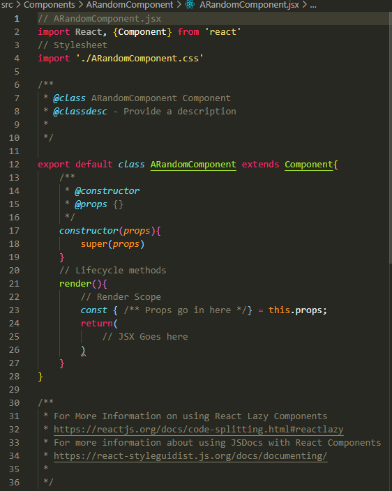

# mkRComponent

## Abstract

A small, simple, blazingly fast  Utility CLI application which creates React component Files based off the users requirements. The application takes in a multi word string from the CLI and creates the named component folder and subsequent component file, along with additional files as specified by the user. 

## Introduction

This node CLI application was created to help ease the time taken to setup and create React components. Not only was it made to help ease the time burden, but also to migiate the repetitive errors that crop up from the laborious process of creating a new react component and its subsequent files. Linking them together, maintaining the same level of clarity throughout your entire project then becomes a developer pain-point over time. 

This creation process that is undertook whenever one wishes to create a new component should be automated. It should be simple and fast, it should be so fast that the time one has already spent making these components and their respective files should be claimed back. 

That is what this application seeks to do, from entering the `npm run mkrcomp <name>` you should be ready to go within half of a half a second. It should have templates as text files that allows you to edit the existing files to suit your own preferences. It should link each file to the other and have the body for each of the accompanying files already set out.Letting you, the developer, to flow straight into your ideas. 

## Installation

To install mkRComponent in the ClI enter the following:

```bash
npm install mkrcomponent@latest --save-dev
```
This would pull down the utility application from npm. We would prefer that this is installed as a developer dependency within your package.json. Our reason is simple, we don't wish to pollute your project with a purely node based application when you come to produce your project. 

### Releases

| Version | Node Version |
|---------| -------------|
| v1.2.0  |     v15      |
## Run the Setup First

Before you kick off, the utility application needs to be informed of the way you write your files. From the language that you prefer using *JSX* or *TSX*, and if you prefer using *Class* based components or *Functional* components. If you wish to use *CSS* or *SASS* as your styling preference. Document your code with *JSDoc* style comments or not. If you wish to include a *Test* file and its own *Story* as well. 

To run the setup for the application enter:
```bash
npm run mkrsetup
```
This would then prompt you to answer a series of questions. Based on your responses, a config file is created. Which would store your preferences, for when you go to use the application proper.

| Order | Question | Choice |
|-------| ---------| -------|
| 1 | Asks for your preferred writing language | JSX/TSX |
| 2 | Asks what you prefer as a Component Type | Class or Function |
| 3 | Asks about your Styling preference  | CSS or SASS |
| 4 | Asks if you wish to include a React Test file | Yes or No |
| 5 | Asks if you want to include JSDocs comments | Yes or No |
| 6 | Asks if you want to have a Component Story File | Yes or No |
| 7 | Saves the settings | Yes or No |




### User Config File

The User configuration file would be stored in the root of the project file, along with your other configuration files for your project. 

The application uses, JS as its file type to store the information, this can be edited with the different responses mentioned above to change with the user as the project grows.


```js
const mkR = {
  writing: {
    preference: 'jsx' || 'tsx',
    type: 'class' || 'function'
  },
  styling: {
    preference: 'css' || 'sass'
  },
  testing: {
    preference: 'yes' || 'no'
  },
  documentation: {
    preference: 'yes' || 'no'
  },
  storytelling: {
    preference: 'yes' || 'no'
  }
};
export default mkR

```
### Templates

The templates that are used are found in the `./node_modules/mkrcomponent/templates` directory. 

As the application grows, all the templates would be found in their corresponding folders.

For Components, we have two separate folders, one is a 'Clean' (JSDoc Comment free) templates, the other folder 'JSDoc' contains prepopulated JSDoc style comments for react components. This is determined by Q5 which determines which files to create. 

Each template is a `.template.txt` file, this prefix informs the utility application to utilise only these files for extrapolating the text and interpolating them with the component name.

It is on the road map for this application that this would be opened up to allow for personal templated to be added. We are currently looking to implement this feature soon.

## Now Lets Play

To operate and use this utility application is by entering:

```bash
npm run mkrcomp <name>
```
The `<name>` argument is required by default. This can be a single term or a multi term string, e.g:
```js
app --> will produce a componet named 'App'
mp app --> will produce a componet named 'MyApp'
button --> will produce a componet named 'Button'
many many buttons --> will produce a componet named 'ManyManyButtons'
```
All terms are sanitised and converted to PascalCase, as per the React naming convention that is established for naming components.



There is a few things to note that is going on here. 

The files are created to the path:
```js
src/Components/
```
From here each component you request to make would be created as its own directory within this parent path.
```js
src/Components/ARandomComponent/Followed by the file
```

Now the application has made up the files, as specified by the end user, in this case the requirements were a JSX Class based component with a stylesheet and its own story and test file, with an accompanying readme document.

The Component folder should look something like this:


As you can see from this example, (given the different combinations you can have, this will look different, but similar)

### Exploring the files

You will see that the files themselves are all prefabricated from the source template files. Where the name of the component themselves are applied and linked to each respective file. 

This helps to mitigate any potential for errors that might come, from doing this manually. It also helps to keep a degree of uniformity and coherent writing across your file system. 



In this example, the body of the React Class component is already written out. With import links to the stylesheet. Other files are similar but refined in their scope and structured accordingly.

## Roadmap

We would be looking to develop on the basis of this utility application to bring more scope and functionality to it.

On the Roadmap is:

- Allow the ability to apply own personal templates to the application
- Lazy React Components 
- Layouts
- Pages
- SubComponents
- Add CLI options to improve UX 

We will be listening keenly to developer feedback, applying features that have strong merit to its inclusion.

## Epilogue

We hope you enjoy using this application and find it useful and helpful to your daily developer experience. If you have any issues or problems utilising this application please don't hesitate to contact via github,


